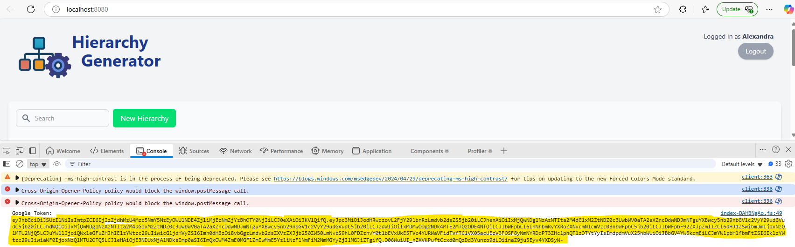
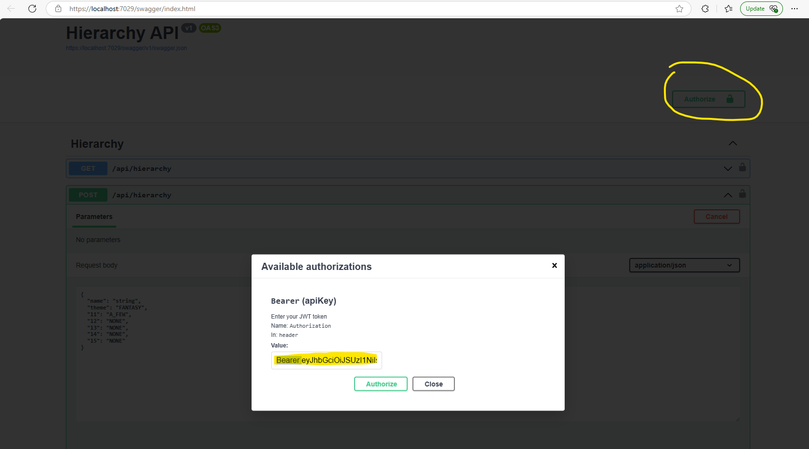

# Hierarchy Generator API

## For Development

### Testing with Swagger

Backend is available here: [API Swagger](http://localhost:1337/swagger/index.html)

## Sending Bearer Tokens

The POST and DELETE requires Authentication in the form of Google JWT tokens. 
You can find JWT in the console of the frontend client when logging in.

Next in Swagger press Authenticate, and in the value write `Bearer ` followed by your jwt.

### Generate SQL Files from Entity Model

Run the following commands to create a `migration.sql` file:

    dotnet ef migrations add InitialMigration

    dotnet ef migrations script -o migration.sql

Use the generated `migration.sql` to update `../HierarchyGeneratorDatabase/database.sql`, which is used to create the database Docker image.