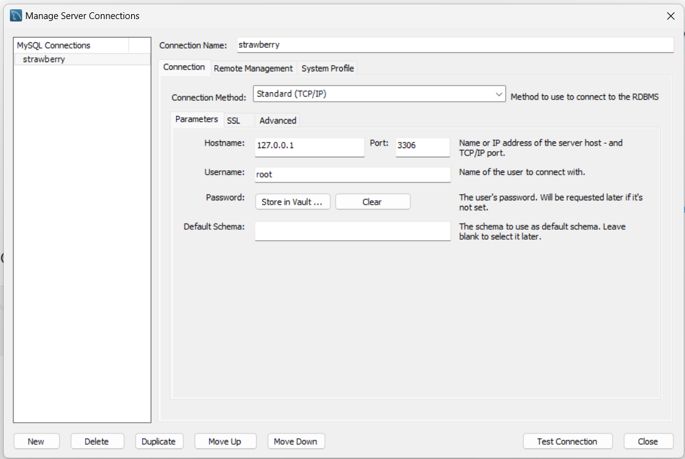
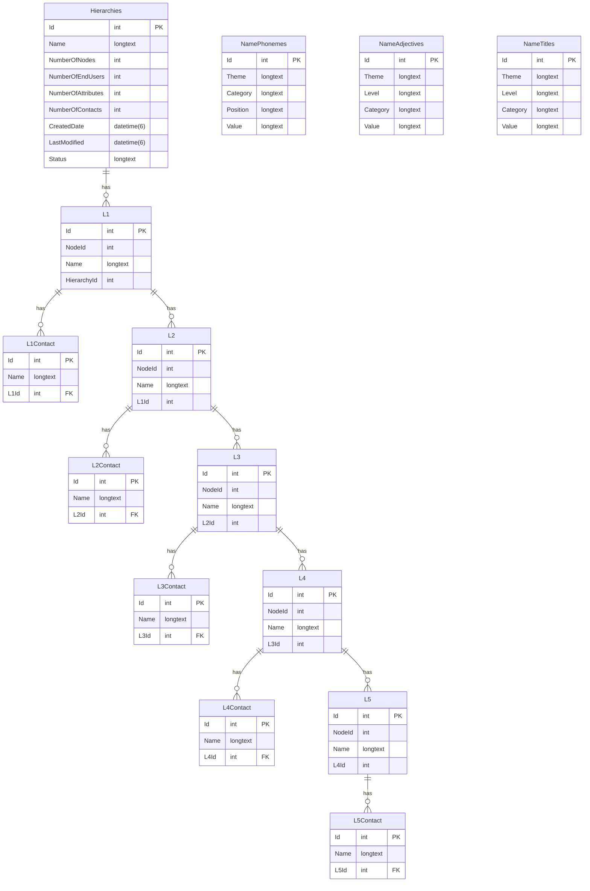

# Database

## How to start the database

Go to parent folder and run:

    docker-compose up -d

## How to look at database using MySQL Workbench

User is `root`
Password is `password`

# How to remove the database

Go to parent folder and run:

    docker-compose down

# Entity Relationship Diagram

