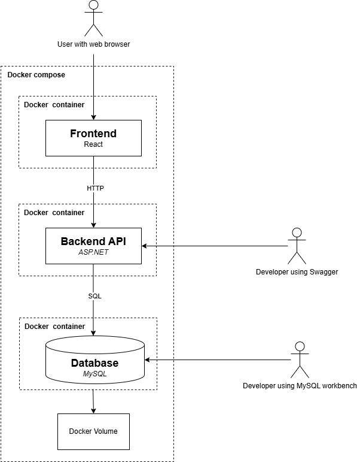

# High-level architectural design

This document defines key system components, their interactions, chosen technologies, and a simple architectural diagram.

## Major Components 

### Frontend

The frontend is built with React and styled using Bootstrap. It communicates with the backend via REST.

### Backend API

The backend is built using ASP.NET and communicates with the database through Entity Framework.

### Database

MySQL is used to store hierarchies.

## Deployment

The application is running in Docker using docket-compose